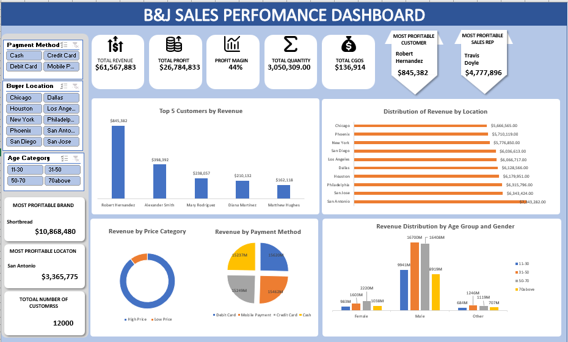

# Biscuit Sales Dashboard (Excel)

## Table of Contents

- [Description](#description)
- [Objectives](#objectives)
- [Tools and Technologies](#tools-and-technologies)
- [Dataset](#dataset)
- [Process](#process)
- [Key Performance Indicators](#key-performance-indicators)
- [Findings](#findings)
- [Recommendations](#recommendations)
- [Conclusion](#conclusion)
- [Contact Me](#contact-me)

## Description

An interactive Excel dashboard analyzing 2024 biscuit retail sales data using pivot tables, charts, and slicers to summarize revenue and profitability across brands, locations, payment methods, and sales representatives.

## Objectives

- Clean and structure raw sales transaction data in Excel
- Build pivot tables for aggregation and comparison
- Design an interactive dashboard with charts and KPI tiles
- Enable dynamic filtering via slicers

## Tools and Technologies

- Microsoft Excel (Advanced)
- Pivot Tables — aggregation and cross-tabulation
- Pivot Charts — bar, line, and pie visualizations
- Slicers — interactive filtering by location, brand, payment method

## Dataset

Retail sales transactions covering 12,000 customers, including:

- Date, location, payment method
- Brand, units sold, unit price, cost
- Revenue, profit, profit category
- Customer demographics (gender, age category)
- Sales representative

## Process

**Cleaning and transformation**
Removed duplicates and blank rows, then standardized date, currency, and numeric formats across the dataset.

**Pivot tables and dashboard build**
Built a pivot table for each dimension — brand, location, sales rep, month — then laid out a dashboard with charts and KPI summary cells on top of them, and added slicers linked across all pivot tables so filtering by location, brand, or payment method updates the whole view at once.

## Key Performance Indicators

| KPI | Value |
|---|---|
| Total Revenue | ₦61,567,883 |
| Total Profit | ₦26,784,833 |
| Profit Margin | 44% |
| Total Quantity Sold | 3,050,309 |
| Total Customers | 12,000 |

## Findings

Shortbread is the most profitable brand by a wide margin, generating ₦10,868,480 in profit — well ahead of any other product line.

San Antonio is the top-performing location by revenue (₦7,343,282), while Chicago trails the other locations at ₦5,666,565, despite similar customer volumes across cities.

Robert Hernandez is the single most profitable customer (₦845,382), and Travis Doyle is the top sales rep by revenue (₦4,777,896) — both well ahead of the next closest in their category.

Revenue splits fairly evenly across payment methods, with no single method dominating customer preference.

## Recommendations

Expand Shortbread's shelf presence and marketing, since it's clearly the strongest-performing brand by profit.

Look into what's driving San Antonio's lead over other locations, and see if any of it — pricing, promotions, local demand — can be applied to close the gap with lower performers like Chicago.

Study what makes reps like Travis Doyle so effective, and use it to raise the floor for lower-performing reps rather than relying on a few standout individuals.

## Conclusion

This dashboard turns a year of raw biscuit sales transactions into something a manager can actually act on — who's buying, what's selling, and where the business is over- or under-performing. It also reflects hands-on Excel skills: pivot tables, pivot charts, and slicers built into a single interactive view.

## Contact Me

- [Email](mailto:zephvic@gmail.com)
- [LinkedIn](https://www.linkedin.com/in/victoryzeph)
- [GitHub](https://github.com/Zephvic)
