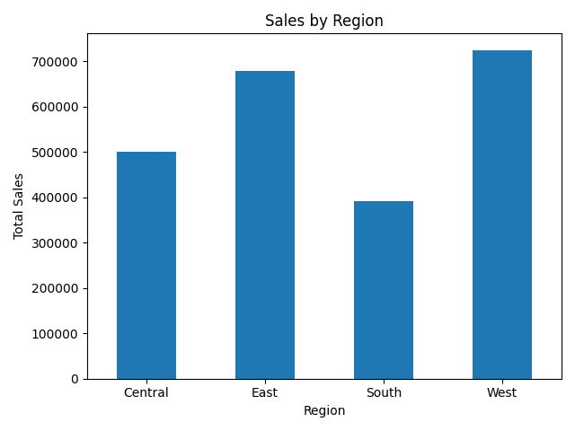
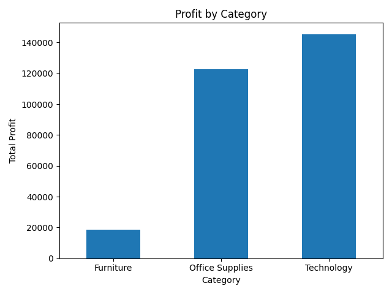
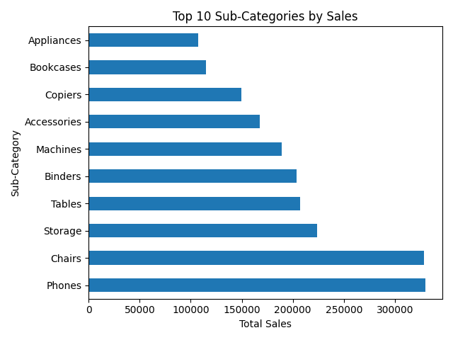
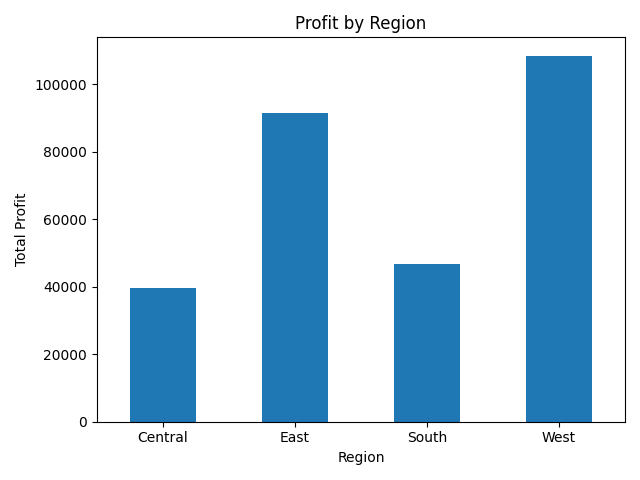
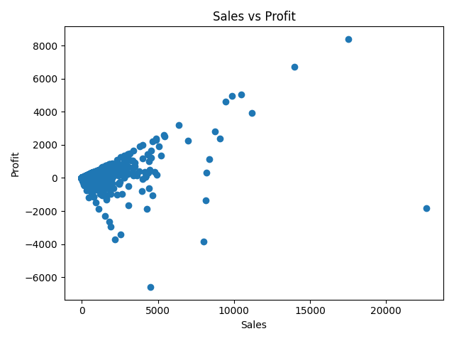

# Sales Performance Analysis

## Table of Contents

- [Description](#description)
- [Objectives](#objectives)
- [Tools and Technologies](#tools-and-technologies)
- [Dataset](#dataset)
- [Process](#process)
- [Visual Outputs](#visual-outputs)
- [Findings](#findings)
- [Recommendations](#recommendations)
- [Conclusion](#conclusion)
- [Contact Me](#contact-me)

## Description

This project analyzes retail sales data to evaluate business performance across regions, product categories, and sub-categories, with the goal of finding what actually drives revenue and profit rather than assuming the two move together.

## Objectives

- Identify high-performing regions
- Determine the most profitable product categories
- Look at how sales and profit relate to each other
- Find products or sub-categories that are losing money
- Turn the analysis into concrete business recommendations

## Tools and Technologies

- Python
- Pandas
- Matplotlib
- Jupyter Notebook

## Dataset

9,994 retail transaction records, including region, category, sub-category, sales, quantity, and profit.

## Process

Loaded the dataset with Pandas and checked data types, structure, and missing values. Computed overall totals for sales, profit, and quantity sold, then grouped the data by region, category, and sub-category to compare performance across each dimension. Built charts for sales by region, profit by category, top sub-categories by sales, profit by region, and the relationship between sales and profit.

## Visual Outputs

## Findings

The West region generated the highest sales (₦725,458) and the highest profit (₦108,418), while the South region had the lowest sales (₦391,722) — though its profit wasn't the lowest, which already suggests revenue and profitability aren't moving together in the same order.

Technology produced the highest profit (₦145,455) despite not having the highest sales, while Furniture had the highest sales among the three categories (₦741,999) but by far the lowest profit (₦18,451) — a category generating volume without the margin to match.

Phones and Chairs are the top two sub-categories by sales, but Tables actually lost money overall (–₦17,725), and Bookcases came in negative too (–₦3,473) — both categories with real sales volume that isn't translating into profit.

## Recommendations

Put more weight behind Technology, since it delivers the strongest profit relative to its sales volume, and review pricing or discounting on Furniture, which sells well but barely breaks even.

Look specifically at Tables and Bookcases — both are losing money despite reasonable sales, which points to a pricing, cost, or discount-strategy problem rather than a demand problem.

Investigate why the South region trails on sales, and consider what's working in the West that could be applied there.

## Conclusion

Sales volume on its own is a poor proxy for business health — several of the best-selling categories and sub-categories here are the weakest on profit. Tracking sales and profit side by side, rather than sales alone, is the main takeaway from this analysis.

## Contact Me

- [Email](mailto:zephvic@gmail.com)
- [LinkedIn](https://www.linkedin.com/in/victoryzeph)
- [GitHub](https://github.com/Zephvic)
