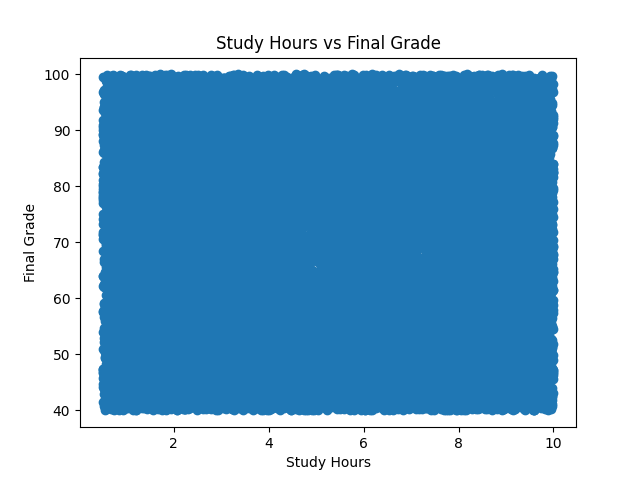
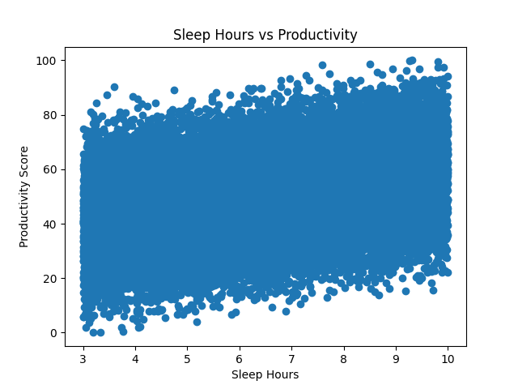
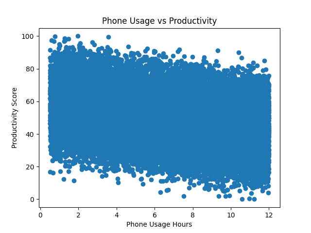
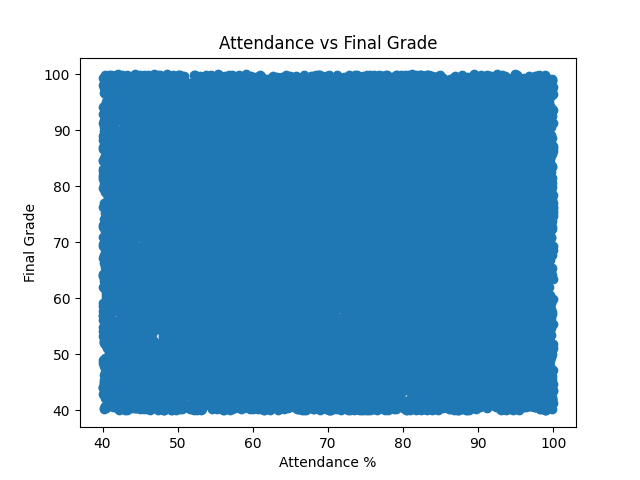
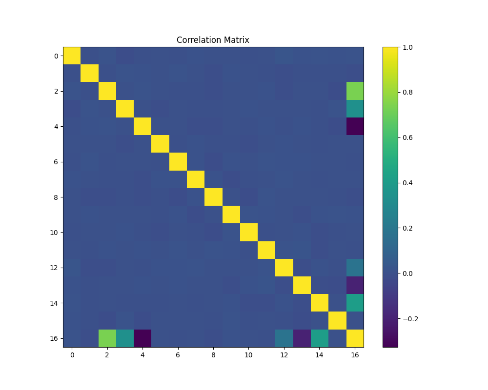
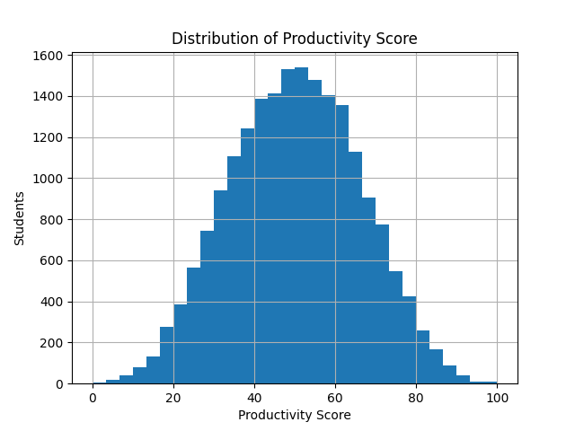

# Student Productivity & Performance Analysis

## Table of Contents

- [Description](#description)
- [Objectives](#objectives)
- [Tools and Technologies](#tools-and-technologies)
- [Dataset](#dataset)
- [Process](#process)
- [Visual Outputs](#visual-outputs)
- [Findings](#findings)
- [Recommendations](#recommendations)
- [Conclusion](#conclusion)
- [Contact Me](#contact-me)

## Description

This project analyzes behavioral and academic data from 20,000 students to see which lifestyle factors actually move productivity and grades, rather than assuming the usual advice (sleep more, study more) holds up in the data.

## Objectives

- Determine which factors most affect productivity
- Check whether those same factors actually affect final grades
- Evaluate the impact of sleep, phone usage, and study habits
- Turn the correlations into practical recommendations

## Tools and Technologies

- Python
- Pandas
- Matplotlib
- Jupyter Notebook

## Dataset

20,000 student records covering study hours, sleep hours, phone and social media usage, attendance, stress level, final grade, and a computed productivity score.

## Process

Loaded the dataset with Pandas and computed correlations between each behavioral variable and two outcomes: productivity score and final grade. Built charts for study hours vs. grade, sleep vs. productivity, phone usage vs. productivity, attendance vs. grade, and a full correlation matrix across all variables.

## Visual Outputs

## Findings

Study hours per day is the strongest driver of productivity score (correlation of 0.73) — by far the biggest factor in the dataset.

Focus score (0.41) and sleep hours (0.34) both correlate positively with productivity, while phone usage (–0.33) and stress level (–0.20) correlate negatively — consistent with the usual advice around focus and screen time.

Final grade, on the other hand, showed almost no correlation with any single factor in this dataset — including study hours, sleep, attendance, or phone usage, all of which sat close to zero. That's a genuinely surprising result: the behaviors that move productivity here don't show up as moving grades, at least not on their own.

## Recommendations

Treat productivity and grades as separate outcomes rather than assuming one drives the other in this dataset — interventions aimed at productivity (protecting study time, managing phone use) shouldn't be pitched as a grade-improvement strategy without more evidence.

Prioritize study time and focus as the two levers most worth protecting, since they show the clearest relationship with productivity.

Treat phone usage and stress as the two behaviors most worth reducing, given their negative pull on productivity.

Investigate final grade separately — it may depend on factors not captured in this dataset (teaching quality, subject difficulty, prior knowledge) rather than day-to-day behavior.

## Conclusion

The clearest result here isn't which habits help — it's that "productive" and "high-scoring" aren't the same thing in this data. Study hours, sleep, and focus track closely with how productive a student reports feeling, but none of it moves the needle on final grade in any measurable way, which is worth sitting with rather than explaining away.

## Contact Me

- [Email](mailto:zephvic@gmail.com)
- [LinkedIn](https://www.linkedin.com/in/victoryzeph)
- [GitHub](https://github.com/Zephvic)
