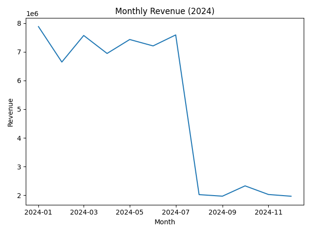
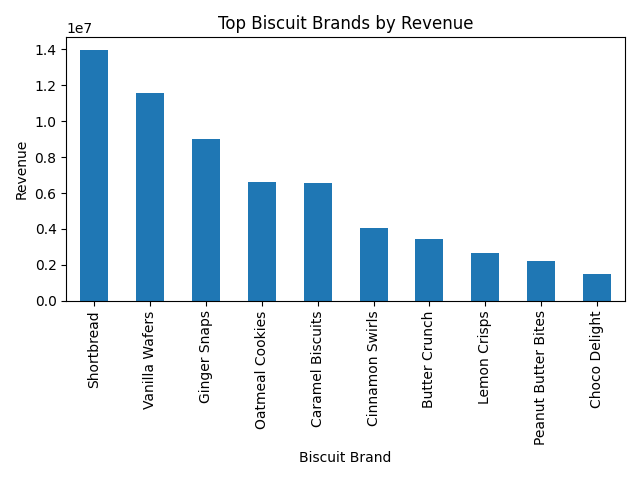
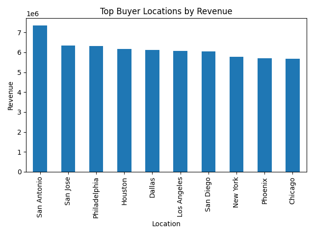
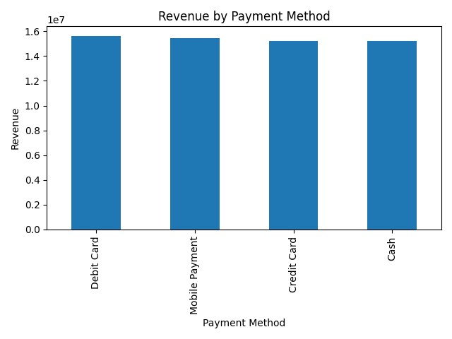
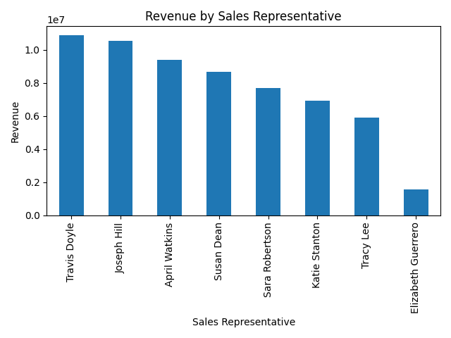
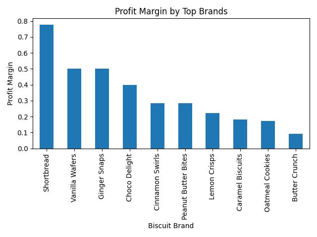

# Biscuit Sales & Profitability Analysis (Python)

## Table of Contents

- [Description](#description)
- [Objectives](#objectives)
- [Tools and Technologies](#tools-and-technologies)
- [Dataset](#dataset)
- [Process](#process)
- [Key Performance Indicators](#key-performance-indicators)
- [Visual Outputs](#visual-outputs)
- [Findings](#findings)
- [Recommendations](#recommendations)
- [Conclusion](#conclusion)
- [How to Run](#how-to-run)
- [Contact Me](#contact-me)

## Description

An end-to-end retail data analysis using Python and Pandas to explore 12,000 biscuit sales transactions from 2024, computing revenue KPIs and visualizing performance across brands, locations, payment methods, and sales representatives.

## Objectives

- Clean and validate raw retail transaction data
- Compute core business KPIs — revenue, profit, margin
- Identify top-performing brands, locations, and sales reps
- Visualize trends and distributions across the dataset

## Tools and Technologies

- Python
- Pandas — data cleaning and aggregation
- Matplotlib — chart generation

## Dataset

- `biscuit_sales_2024.csv` — 12,000 transaction records
- `products.csv` — product reference data

## Process

Loaded and cleaned the transaction data with Pandas, computed KPIs using groupby and aggregation across brand, location, sales rep, and month, then generated charts covering each of those dimensions with Matplotlib.

## Key Performance Indicators

| Metric | Value |
|---|---|
| Total Orders | 12,000 |
| Total Units Sold | 3,050,309 |
| Total Revenue | ₦61,567,883 |
| Total Profit | ₦26,784,833 |
| Overall Profit Margin | 43.5% |
| Top Brand (Revenue) | Shortbread — ₦13,973,760 |
| Top Location | San Antonio — ₦7,343,282 |
| Top Sales Rep | Travis Doyle — ₦10,880,651 |
| Best Month | January 2024 — ₦7,878,885 |

## Visual Outputs








## Findings

Shortbread is the clear leader by revenue (₦13.97M), and Travis Doyle is the top-performing sales rep by a wide margin (₦10.88M) — both well ahead of the next closest in their category.

San Antonio outperforms every other location, and January was the strongest month of the year by a noticeable margin, suggesting some early-year demand or promotional effect worth understanding.

A 43.5% profit margin across 12,000 orders is solid, but it isn't even across brands — margin varies enough by brand that revenue leaders aren't automatically the most profitable ones.

## Recommendations

Look at what's driving January's strength and see whether it can be replicated, rather than treated as a one-off.

Study San Antonio's performance against other locations to see what's transferable — pricing, local demand, or distribution.

Check profit margin by brand rather than just revenue by brand — a brand that sells well isn't necessarily the one worth prioritizing if its margin is thin.

## Conclusion

This project turns a full year of biscuit sales data into a clear picture of what's actually driving the business — which brands, reps, and locations matter, and where revenue and profit diverge. It also demonstrates a practical Python and Pandas workflow: cleaning, aggregating, and visualizing a dataset of real size end to end.

## How to Run

```bash
pip install -r requirements.txt
python biscuit_sales_analysis.py
```

The script loads the CSV, computes the KPIs, prints a summary, and saves all charts to the project folder.

## Contact Me

- [Email](mailto:zephvic@gmail.com)
- [LinkedIn](https://www.linkedin.com/in/victoryzeph)
- [GitHub](https://github.com/Zephvic)
