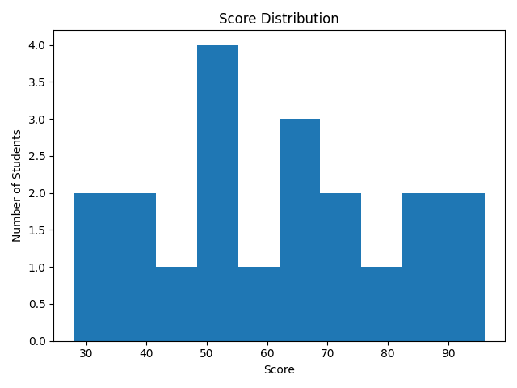
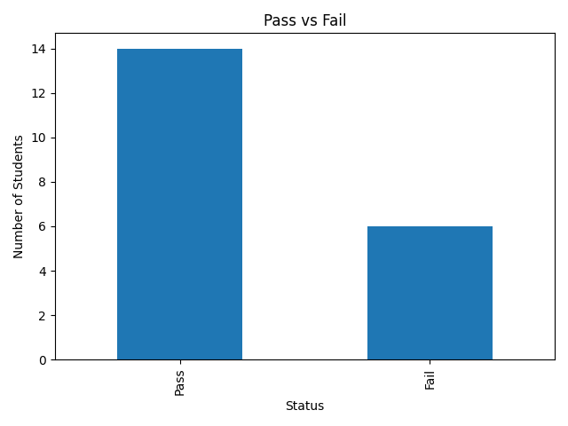
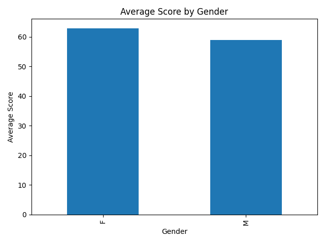

# Student Performance Analysis

## Table of Contents

- [Description](#description)
- [Objectives](#objectives)
- [Tools and Technologies](#tools-and-technologies)
- [Dataset](#dataset)
- [Process](#process)
- [Visual Outputs](#visual-outputs)
- [Findings](#findings)
- [Conclusion](#conclusion)
- [How to Run](#how-to-run)
- [Contact Me](#contact-me)

## Description

A Python-based analysis of student exam scores — classifying pass/fail outcomes, assigning letter grades, and visualizing how performance breaks down by gender.

## Objectives

- Load and clean the student exam dataset
- Classify students as pass or fail (pass mark: 50)
- Assign letter grades (A–F)
- Identify top and bottom performers
- Visualize the score distribution, pass/fail split, and gender comparison

## Tools and Technologies

- Python
- Pandas
- Matplotlib

## Dataset

20 student records, including name, score, gender, age, and class.

## Process

Loaded the dataset with Pandas, derived a pass/fail flag and a letter grade for each student, then computed summary statistics and built charts for the score distribution, pass/fail split, and average score by gender.

## Visual Outputs





## Findings

70% of the class passed (14 of 20 students), with Queen scoring highest at 96 and Vera lowest at 28.

Female students averaged a slightly higher score than male students (62.9 vs. 58.9), though the sample is small enough that this shouldn't be read as a strong trend.

## Conclusion

A small dataset, but enough to demonstrate the core workflow: cleaning raw scores, deriving pass/fail and grade fields, and turning them into a distribution and comparison that's easy to read at a glance.

## How to Run

```bash
pip install pandas matplotlib
python analysis.py
```

## Contact Me

- [Email](mailto:zephvic@gmail.com)
- [LinkedIn](https://www.linkedin.com/in/victoryzeph)
- [GitHub](https://github.com/Zephvic)
