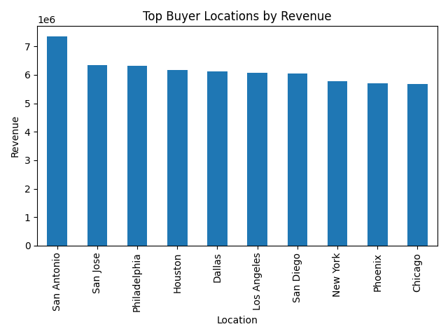
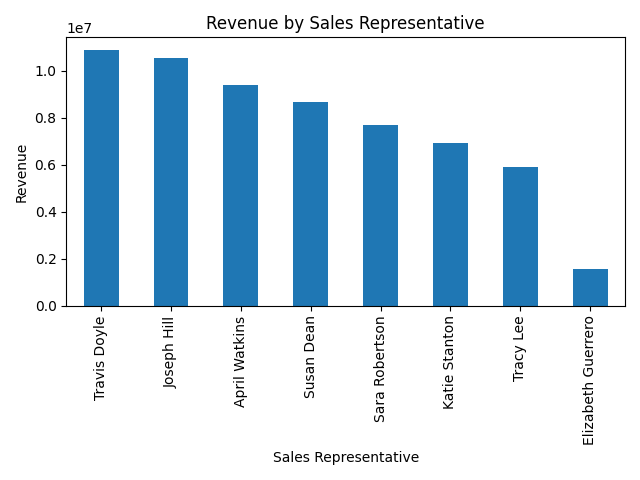
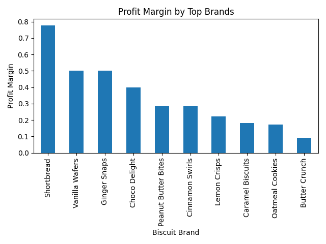

# 🍪 Biscuit Sales & Profitability Analysis (Python)

An end-to-end retail data analysis project using Python and Pandas to explore 12,000 biscuit sales transactions from 2024. The project computes revenue KPIs and visualizes performance across brands, locations, payment methods, and sales representatives.

---

## 📌 Objectives

- Clean and validate raw retail transaction data
- Compute business KPIs (revenue, profit, margin)
- Identify top-performing brands, locations, and sales reps
- Visualize trends and distributions with charts

---

## 📊 Key KPIs

| Metric | Value |
|---|---|
| Total Orders | 12,000 |
| Total Units Sold | 3,050,309 |
| Total Revenue | ₦61,567,883 |
| Total Profit | ₦26,784,833 |
| Overall Profit Margin | **43.5%** |
| Top Brand (Revenue) | Shortbread — ₦13,973,760 |
| Top Location | San Antonio — ₦7,343,282 |
| Top Sales Rep | Travis Doyle — ₦10,880,651 |
| Best Month | January 2024 — ₦7,878,885 |

---

## 📈 Visual Outputs

### Monthly Revenue Trend


### Top Brands by Revenue


### Top Locations by Revenue


### Revenue by Payment Method


### Revenue by Sales Rep


### Profit Margin by Brand


---

## 🛠️ Tools & Libraries

- **Python** — core language
- **Pandas** — data cleaning and aggregation
- **Matplotlib** — chart generation

---

## 📂 Project Structure

```
biscuit-sales-profitability-analysis/
├── biscuit_sales_analysis.py   # Main script
├── requirements.txt
├── data/
│   ├── biscuit_sales_2024.csv  # 12,000 transaction records
│   └── products.csv
├── monthly_revenue.png
├── top_brands_revenue.png
├── top_locations_revenue.png
├── revenue_by_payment.png
├── revenue_by_sales_rep.png
└── profit_margin_by_brand.png
```

---

## ▶️ How to Run

```bash
pip install -r requirements.txt
python biscuit_sales_analysis.py
```

The script will load the CSV, compute KPIs, print a summary, and save all charts to the project folder.

---

## 🧠 What This Demonstrates

- Data cleaning and validation on a real-world-sized dataset
- KPI computation using Pandas groupby and aggregation
- Multi-dimensional analysis (product, geography, rep, time)
- Clear visual storytelling with Matplotlib
